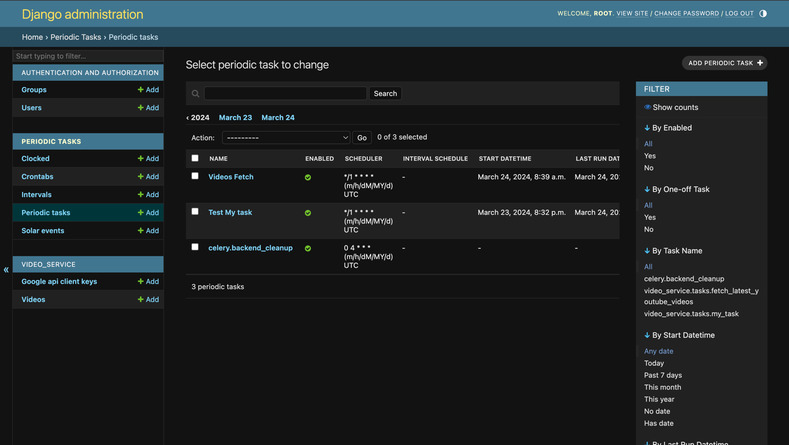
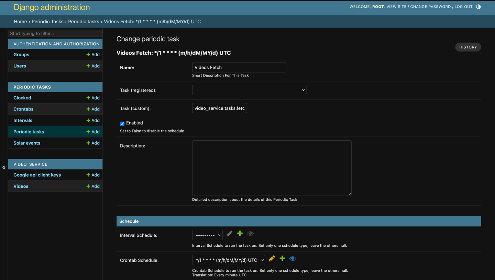
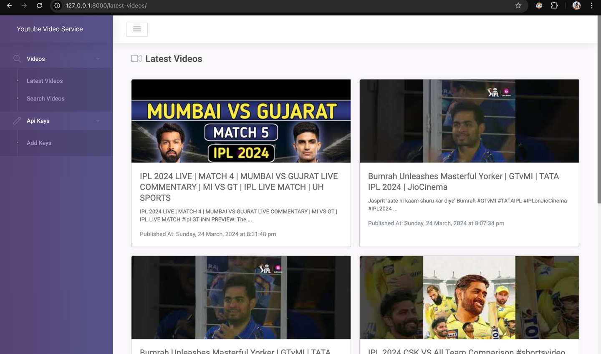
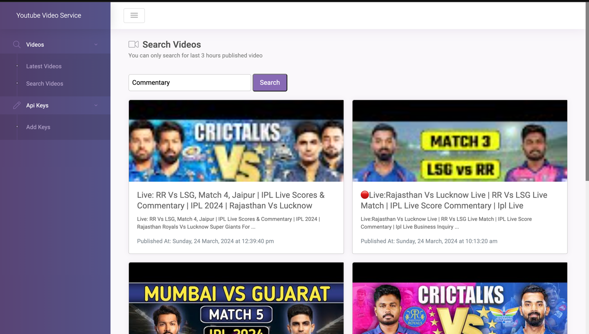
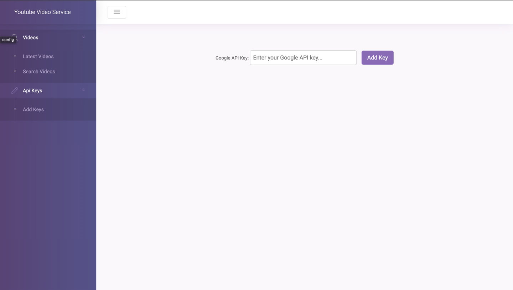

# Latest YouTube Videos Project

This project is aimed at displaying the latest YouTube videos using a Django web application. It utilizes Celery for background task processing and Redis as a message broker.

Predefined Search Topic: `IPL 2024`

## Services

### Web Service
- **Build**: Build the Docker image using the current directory.
- **Command**: Start the Django server by running `python manage.py runserver 0.0.0.0:8000`.
- **Volumes**: Mount the current directory as `/app`.
- **Ports**: Expose port 8000.
- **Depends On**: Depends on the Redis service.

### Redis Service
- **Image**: Use the `redis:alpine` image.
- **Ports**: Expose port 6379.

### Celery Service
- **Build**: Build the Docker image using the current directory.
- **User**: Use the `django-user` user.
- **Command**: Start the Celery worker by running `celery -A latest_youtube_videos worker --loglevel=info`.
- **Volumes**: Mount the current directory as `/app`.
- **Depends On**: Depends on the Redis service.

### Celery Beat Service
- **Build**: Build the Docker image using the current directory.
- **User**: Use the `django-user` user.
- **Command**: Start the Celery beat scheduler by running `celery -A latest_youtube_videos beat --loglevel=info --scheduler django_celery_beat.schedulers:DatabaseScheduler`.
- **Volumes**: Mount the current directory as `/app`.
- **Depends On**: Depends on the Redis service.

## Database
- **Type**: SQLite
- **Location**: `/app/db.sqlite3`
- **We can other databases like PostgreSQL, MySQL, etc.**
- **Currently Migration is already done in uploaded Sql Lite Database but if we want to connect to new db we need to do migrations**

## URLs
- **UI URLs**:
  - `/`: Home page.
  - `/latest-videos/`: Display the latest YouTube videos.
  - `/video-search/`: Search for videos.
  - `/add-key/`: Add Google API key.

- **API URLs**:
  - `/api/videos/`: Retrieve all videos.
  - `/api/add-key/`: Add Google API key.
  - `/api/search/`: Search for videos.

## Celery Tasks
- **my_task**: Sample Celery task.
- **fetch_latest_youtube_videos**: Task to fetch and store the latest YouTube videos.

## Adding Google API Key
To add your Google API key for accessing the YouTube Data API, follow these steps:
1. Access the `/add-key/` UI page.
2. Enter your API key in the provided input field.
3. Click the "Add Key" button to save the API key.
4. Once added, the API key will be used for fetching YouTube video data.

## Running the Project
To run the project, use the following command:

```bash
docker-compose up --build
```

If first time initializing the database, Open another terminal and run the following command to do migrations (We dont need to do this if we are using the uploaded Sql Lite Database)
```bash 
docker-compose exec web python manage.py migrate
docker-compose exec web python manage.py createsuperuser
```
Complete the User Creation Flow after entering required details

**Note: Stop the running containers and rerun the `docker-compose up --build` command after executing the above commands.** 


Now you can access the Django Admin Panel using the following URL: `http://localhost:8000/admin/`





# Dashboard UI Pages

**Latest Videos Page (With Pagination)**



**Search Videos Page**



**Add Google API Key Page**

